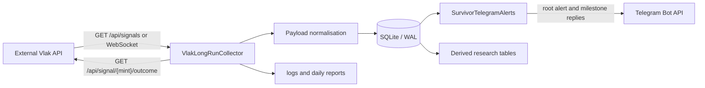

# Architecture

## Current architecture

Vlak Bot is a single Python process. There is no internal microservice boundary, Redis queue, PostgreSQL database, webhook listener, or HTTP API in this repository.

## Components and responsibilities

### Collector authority

`vlak_long_run_collector.py` owns process startup, API clients, signal ingestion, scheduling, outcome refresh, current/maximum outcome persistence, task loops, heartbeat, and daily summary sending.

The process lock on TCP port `49322` prevents a second collector instance on the same host.

### Normalisation boundary

`aladdin_research_engine/normalizers.py` maps multiple possible Vlak key names to a common shape. It should not make trading decisions. The current checkout cannot import it because `.db.json_dumps` is missing.

### Database authority

SQLite is both the durable event store and the operational coordination store. WAL mode is enabled. There is no separate transaction queue. Important authority boundaries:

- Raw evidence: `vlak_alert_events`, `vlak_outcome_snapshots`, raw JSON and hashes.
- Current/max outcome authority: `vlak_token_outcomes`.
- Pending work authority: `vlak_tracking_schedule`, `telegram_survivor_active_polling`.
- Telegram delivery authority: `telegram_survivor_threads`, `telegram_survivor_milestones`.
- Derived research: survivor signals, metric snapshots, field catalog, alert-entry matrix.

### Telegram authority

`vlak_survivor_telegram.py` owns the public gate and send-side deduplication. Constants currently define `1.4x <= first alert <= 2.5x`. It stores a thread row before the network send to claim the mint.

## Synchronous and asynchronous work

- Signal polling, WebSocket ingestion, outcome loop, heartbeat and daily summary run as asyncio tasks.
- SQLite operations are synchronous and occur inside the event loop.
- HTTP uses `httpx.AsyncClient`; WebSocket uses `websockets`.
- Derived survivor and feature-matrix upserts run synchronously after an outcome refresh.

Large SQLite writes or research upserts can therefore delay other async work.

## Acknowledgement boundaries

There is no message broker acknowledgement. For polling, a signal is considered handled after its database transaction commits. For Telegram, the root thread is claimed before the HTTP send, and the returned message ID is written afterward. A crash between those events leaves an unresolved claim.

## Error handling and retries

- Signal polling logs failures and sleeps before retrying.
- Polling and WebSocket loops are supervised and restarted after crashes.
- WebSocket reconnect delay doubles up to 60 seconds.
- Outcome calls retry three times; 429 responses back off.
- Failed schedule rows retain attempt/error information and can be due again.
- Telegram send failures are logged, but root-claim recovery is incomplete.

## Replay and recovery

- Raw/outcome rows remain in SQLite across restart.
- Unique hashes and schedule keys make repeated writes mostly idempotent.
- The first polling response is treated as a baseline.
- Live-start state suppresses historical root alerts.
- A hard-coded root-date cutoff suppresses historical milestone replay.
- There is no formal dead-letter queue, schema version, backup command, or replay CLI.

## Partially implemented architecture

Shadow Strong Watch tables and methods exist, but the candidate processor is disabled. The public alert path attempts an optional CatBoost scorer that is not shipped. These are not part of production decision authority.

## Proposed architecture

No proposed multi-service architecture is encoded in this repository. Redis, PostgreSQL, Rust, Vulcan, wallet P&L, and terminal UI must not be assumed. Any such migration requires a separate approved architecture decision.

