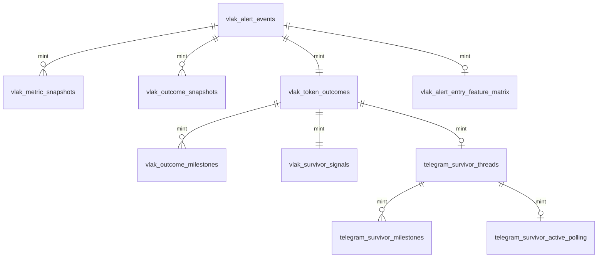

# Database Reference

## General rules

- Engine: SQLite with WAL and foreign keys enabled on collector connections.
- Base schema owner: `migrate_vlak_long_run_schema.py`.
- Additional schema owners: `vlak_survivor_telegram.py`, `vlak_long_run_collector.py`, and `vlak_alert_entry_feature_matrix.py`.
- No declared foreign-key constraints were found. Relationships use `mint`, notification ID, payload hash, report date, or source by convention.
- Timestamps are stored as ISO-8601 text and are intended to be UTC unless a reporting function explicitly uses Europe/London.

## Raw and operational tables

### `vlak_alert_events`

- Purpose: immutable-ish raw Vlak call evidence and first-seen metrics.
- Primary key: `id`; unique: `raw_payload_hash`.
- Join keys: `mint`, `notification_id`.
- Important columns: `alert_time`, `first_call_market_cap`, `market_cap`, liquidity, volume, buys, holders, risk percentages, `is_first_alert_per_mint`, `raw_json`.
- Writer: `VlakLongRunCollector.save_alert`.
- Readers: outcome baseline, Telegram loader, research builders, daily summaries.
- Authority: authoritative raw receipt inside this system.
- Risk: no retention policy; raw JSON can grow indefinitely.

### `vlak_metric_snapshots`

- Purpose: normalised point-in-time metrics captured from calls.
- Primary key: `id`; no unique snapshot constraint.
- Join: `mint`, `notification_id`; ordering: `snapshot_time`.
- Writer: `save_metric_snapshot`.
- Readers: survivor crossing/feature selection.
- Authority: supporting snapshot evidence.
- Risk: duplicate logical observations are possible.

### `vlak_outcome_snapshots`

- Purpose: every normalised outcome API observation plus raw JSON.
- Primary key: `id`; join: `mint`; ordering: `snapshot_time`.
- Writer: `save_outcome`.
- Readers: token outcome upsert, Telegram, research labels.
- Authority: raw outcome history.
- Risk: no unique hash constraint on this table, although hashes are stored.

### `vlak_token_outcomes`

- Purpose: one current/max outcome row per mint.
- Primary/join key: `mint`.
- Important columns: first baseline, latest/current MC, ATH MC, max multiple, hit flags, completion.
- Writer: `upsert_latest_outcome`.
- Readers: Telegram, summaries, survivor research.
- Authority: canonical operational outcome summary.
- Consistency rule: ATH, multiple, and hit flags are monotonic through SQL `MAX`.

### `vlak_tracking_schedule`

- Purpose: durable outcome-check schedule.
- Primary key: `id`; unique: `(mint, checkpoint_label)`.
- Important columns: `due_at`, `completed_at`, attempts, last error.
- Writer/reader: collector scheduling and outcome loop.
- Authority: pending-work authority.
- Replay: incomplete due rows are retry candidates.

### `vlak_ingestion_errors`

- Purpose: operational error journal.
- Primary key: `id`; joins: mint/notification.
- Writer: collector `log_error`.
- Authority: diagnostics only.
- Risk: no retention or acknowledgement state.

### `vlak_api_payload_audit`

- Purpose: request/result metadata and payload fingerprints.
- Primary key: `id`; join: `raw_payload_hash`, mint, notification.
- Writer: collector `audit_payload`.
- Authority: audit evidence, not outcome truth.

## Telegram tables

### `telegram_survivor_armed`

- Purpose: one record when a mint reaches the 1.4x arming threshold.
- Primary key: `mint`.
- Writer: `SurvivorTelegramAlerts.mark_armed`.
- Authority: qualification-state evidence.

### `telegram_survivor_live_state`

- Purpose: stores the live-start boundary used to prevent historical root replay.
- Primary key: `source`.
- Writer: live-start methods in `SurvivorTelegramAlerts`.
- Authority: operational replay boundary.

### `telegram_survivor_shadow_exclusions`

- Purpose: suppresses pre-live or late-entry mints from public root delivery.
- Primary key: `mint`.
- Important columns: reason, first qualification, multiple, live-start time.
- Writer: `mark_shadow_if_pre_live`, `mark_late_root_if_above_cap`.
- Authority: public-send exclusion state.
- Risk: late reason text still says `ABOVE_3X` although active cap is 2.5x.

### `telegram_survivor_threads`

- Purpose: one public root Telegram thread per mint.
- Primary key: `mint`.
- Important columns: chat/message ID, first alert threshold/multiple/time.
- Writer: `send_root_alert`.
- Reader: all milestone and deduplication paths.
- Authority: public root delivery state.
- Risk: row is claimed before network send; a null message ID can block automatic retry.

### `telegram_survivor_milestones`

- Purpose: Telegram milestones already claimed/sent.
- Primary key: `id`; unique: `(mint, threshold)`.
- Writer: root and milestone send paths.
- Authority: send-side deduplication.
- Risk: thresholds can include 0.5x update markers as well as fixed milestones.

### `telegram_survivor_active_polling`

- Purpose: active/inactive polling state after a root alert.
- Primary key: `mint`.
- Important columns: buy counts, no-growth time, next due, checks and missing count.
- Writer/reader: collector active polling methods.
- Authority: polling cadence state, not market outcome truth.

### `telegram_daily_top_gains_summaries`

- Purpose: one daily Top Gains message record.
- Primary key: `report_date`.
- Created at runtime by collector.
- Authority: daily-summary send ledger.
- Risk: a row is inserted before send; interruption can prevent a retry.

## Research and derived tables

### `vlak_survivor_signals`

- Purpose: one research-friendly row per token crossing 1.4x.
- Primary key: `mint`.
- Contains survivor-time features plus future ATH, hit flags and time-to-milestone labels.
- Writer: `vlak_survivor_research.upsert_survivor_signal`.
- Authority: derived research table.
- Leakage warning: future outcome fields are not alert-time features.

### `vlak_api_metric_snapshots`

- Purpose: broad normalised metric catalog across API payloads.
- Primary key: `id`; unique: `raw_payload_hash`.
- Writer: `store_api_metric_snapshot`.
- Authority: derived snapshot evidence.

### `vlak_outcome_milestones`

- Purpose: milestone labels and timestamps recovered from outcome payloads.
- Primary key: `id`; unique: `(mint, threshold_label)`.
- Writer: `store_outcome_milestones`.
- Authority: derived API milestone summary; raw outcome remains stronger evidence.

### `vlak_api_field_catalog`

- Purpose: observed raw JSON field inventory and storage mapping.
- Primary key: `id`; unique: `(endpoint, field_name)`.
- Writer: research catalog builder.
- Authority: documentation/research only.

### `vlak_alert_entry_feature_matrix`

- Purpose: Telegram alert-time feature row plus post-alert outcome labels.
- Primary key: `mint`.
- Created/updated by `vlak_alert_entry_feature_matrix.py`.
- Authority: derived research matrix.
- Critical risk: standalone rebuild defaults to dropping and recreating the table; future labels can leak into training inputs.

### `vlak_daily_summaries`

- Purpose: local operating summary by report date.
- Primary key: `report_date`.
- Writer: collector report methods.
- Authority: derived KPI output.

## Deprecated/shadow tables

### `vlak_shadow_tracking_sessions`

- Primary key: `session_id`.
- Purpose: shadow experiment sessions.
- Status: deprecated/inactive because candidate processing returns zero.

### `vlak_bot_config`

- Primary key: `key`.
- Purpose: key/value configuration used by shadow session code.
- Status: active only if shadow methods are invoked; not the main environment configuration authority.

### `vlak_shadow_alerts`

- Primary key: `mint`.
- Purpose: Strong Watch feature/outcome tracking.
- Status: shadow/deprecated in current runtime.
- Risk: schema is created on every Telegram database connection despite the processor being disabled.

## Relationship map

These relationships are logical only; the schema declares no foreign keys.

